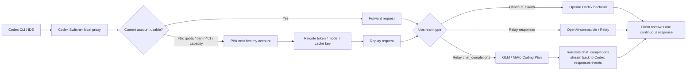

# Codex Switcher

[](https://github.com/xtftbwvfp/codex-switcher/releases/latest)
[](https://github.com/xtftbwvfp/codex-switcher/actions/workflows/release.yml)
[](LICENSE)
[](https://tauri.app/)
[](https://github.com/xtftbwvfp/codex-switcher/releases/latest)

**中文** | [English](#english) | [Русский](#русский)

Codex Switcher 是一个面向 Codex CLI / Codex App 多账号工作流的桌面工具。它把账号管理、配额观察、本地代理、无损自动切号、中转站、Coding Plan 接入、远程账号池和 Skills 管理放在同一个 Tauri 应用里，适合长期使用 Codex CLI、Codex App，以及支持 Codex 插件的 VS Code 及其衍生 IDE 的多账号环境。

**一句话：当前账号限额了，前端任务不用停，Codex Switcher 在代理层自动换号、切换中转站或接入 Coding Plan，并自动重发请求。Coding Plan 目前已支持 GLM 和 Xiaomi MiMo Token Plan，其他平台待实测。**

[下载最新版](https://github.com/xtftbwvfp/codex-switcher/releases/latest) · [配合 glance 使用](https://github.com/xtftbwvfp/glance)

## 亮点

- **手机锚（v0.7.0 新增）**：Codex.app 26.513+ 加了"手机远程连接"功能（手机/Codex.app 桌面端通过 ChatGPT 后端 bridge），但 bridge 鉴权绑死 `auth.json` 的 `chatgpt_account_id`，每次切号必断。手机锚把 disk 锁定在指定订阅号 —— 切到非锚账号时**磁盘不动 / proxy 出口照切**，让 Codex.app 仍以锚账号身份在线，手机端不掉线，而你的 codex CLI 实际跑在切走的那个号上。后台 4 min 独立 tick 保活锚号 token，rt 单写者保持是 Codex Switcher。详见[安装节][#手机锚phone-anchorv070]。
- **会话路由（v0.6.0 新增）**：UI 一键把 codex 的"当前活跃会话"硬绑到指定账号 —— 这个对话强制走 GLM Coding Plan、那个对话强制走 MiMo、剩下走 ChatGPT。**绑完立刻生效**，不需要关 codex tab、不需要重启 Codex Switcher；底层用 `ws_disconnect` 踢断长连接、让 codex 自动重连进新路由。
- **无损切号**：限额、封禁、401、全局容量不足时，代理层自动换号并重发请求，前端软件无感知。401 / 429 / 上下文超限 / token 失效 / RT 被轮换都已闭环。
- **三类账号统一调度**：订阅 (ChatGPT OAuth/API Key) · 中转 (PinCC/PackyCode/CLIProxyAPI 等聚合 reseller) · Coding Plan (GLM/MiMo/火山/UCloud 等厂商订阅) · 三方 (DeepSeek/Kimi/MiniMax/通义/Fireworks/OpenRouter 等按量付费)。可分别独立过滤、独立挑号策略。
- **17 个内置 Relay preset**：除 GLM 和 MiMo 外，新增 DeepSeek / Moonshot / MiniMax / 通义千问 / 火山方舟 / 腾讯混元 / 百度千帆 / UCloud / Fireworks / Stepfun / OpenRouter + 一个适配所有 new-api/sub2api/CLIProxyAPI 兼容站的通用 Responses 中转。
- **GLM Coding Plan 兼容**：把 Codex `/v1/responses` 实时翻译成 OpenAI `/chat/completions`，让 GLM Coding Plan 也能跑 Codex 请求。
- **Xiaomi MiMo Token Plan 兼容**：内置 MiMo-V2.5 Token Plan 新加坡端点 preset，支持 `tp-` key 和 Chat Completions 翻译。MiMo thinking 模式 `reasoning_content` 强校验做了历史修剪 workaround。
- **DeepSeek 已端到端验证**：单轮、多轮 tool_call、`deepseek-reasoner` 流式 reasoning summary 全部通过；模型映射 `gpt-* → deepseek-chat / o1 → deepseek-reasoner`。
- **上下文超限自动 compact**：上游（GLM 1261 等）拒收时，代理把错误归一化成 OpenAI `context_length_exceeded`，codex CLI 收到后自动触发 compact 而不是退出。
- **余额接口自动探测**：第一次刷新中转账号余额时按顺序 probe `/v1/dashboard/billing/*`（new-api 系）→ `/v1/usage`（sub2api / OpenAI 兼容）→ 都不通则不拉。探测结果落库，下次直接走对应 fetcher。
- **可观测配额**：5 小时/周配额、token、成本、cache savings、切号原因、周期历史都能看。
- **长期开发友好**：session affinity 保住 prompt cache，`prompt_cache_key` 按账号隔离，减少切号后的缓存污染。
- **跨工具 Skills**：把 Codex/Claude/Gemini/OpenCode 的 Skills 统一发现、安装、同步。

## 目录

- [界面预览](#界面预览)
- [为什么需要它](#为什么需要它)
- [工作方式](#工作方式)
- [推荐组合：GLM Coding Plan + glance](#推荐组合glm-coding-plan--glance)
- [核心能力](#核心能力)
- [功能点速览](#功能点速览)
- [界面模块](#界面模块)
- [账号导入方式](#账号导入方式)
- [兼容矩阵](#兼容矩阵)
- [Provider 清单](#provider-清单)
- [典型使用方式](#典型使用方式)
- [安装](#安装)
- [从源码运行](#从源码运行)
- [数据和安全边界](#数据和安全边界)

## 界面预览

### 桌面应用


## 为什么需要它

Codex CLI 的账号、配额、Token、缓存和代理问题通常是分散的：一个工具负责登录，一个脚本负责切号，一个代理负责转发，另一个表格记录用量。Codex Switcher 把这些动作收在一个桌面应用里，并且在代理层真正理解 Codex 请求流。

它不只是“换 `auth.json`”。它的王炸功能是：**无损切号**。

- 当前账号触发限额、封禁、401、全局容量不足时，代理层可以自动选下一个可用账号。
- 前端软件无感知，不需要用户手动复制 prompt、重启任务或重新发起请求。
- 对可重试场景，代理会在后台换号并重发请求，客户端看到的是一次连续请求。
- 能把 Codex 的 `/v1/responses` 请求实时翻译成 OpenAI `/chat/completions`，让 GLM Coding Plan、Xiaomi MiMo Token Plan 这类并不完整支持 Codex Responses 协议的服务也能接入。
- 能在 SSE 流还没吐给客户端前识别限额、封禁、全局容量不足，然后静默换号重试。
- 能在 WebSocket 消息里识别限额和封禁信号。
- 能按 session 做 sticky routing，尽量保住 prompt cache。
- 能给不同账号隔离 `prompt_cache_key`，避免跨账号缓存污染。
- 能把 ChatGPT 订阅账号、OpenAI Key、第三方 Relay、远程账号池放在同一套切换逻辑里。
- 能记录 5 小时/周周期、每次切号、每个 session 的 token 和成本。

## 工作方式



## 推荐组合：GLM Coding Plan + glance

如果你有 GLM Coding Plan，可以把它接进 Codex Switcher 当 Relay 后端，再配合另一个项目 [glance](https://github.com/xtftbwvfp/glance) 使用。

`glance` 是一个 MCP server，用便宜的子模型处理“读一堆文件再总结”“搜索 GitHub 仓库”“抓网页正文”“OCR/描述图片”“Chrome 自动化”等低难度重活。主 Codex 继续负责架构判断和最终代码修改，GLM Coding Plan 负责消耗大的苦活。

推荐分工：

- Codex Switcher：负责 GLM Coding Plan 接入、协议转换、自动切号、重试和配额可视化。
- glance：负责把跨文件阅读、repo 调研、网页抓取、图片理解这类 token-heavy 工作下放给 GLM/DeepSeek/OpenAI 子模型。
- Codex CLI：拿到压缩后的结论，少读原始大文件，把主模型窗口留给真正需要推理和修改的部分。

这个组合适合长期开发：Codex Switcher 保证请求不中断，glance 让低难度高 token 的任务走 Coding Plan，用更低成本把任务量堆起来。

## 核心能力

### 多账号管理

- 支持 ChatGPT OAuth 账号、OpenAI API Key 账号、第三方 Relay/API Key 账号。
- 一键切换当前账号，写入 Codex CLI 使用的 `~/.codex/auth.json`。
- 支持导入、导出、批量导入账号数据。
- 支持 OAuth 登录、OTP 邮箱批量登录、Token 自动刷新。
- 支持账号禁用、Token 失效、隔离状态识别，并提供修复入口。
- 支持系统托盘快速切换和后台运行。

### 本地代理与自动切号

Codex Switcher 可以启动本地 HTTP/WebSocket 代理，让 Codex CLI 或其他客户端统一走本地端口。代理层会观察请求、SSE 流和错误信息，并在合适时机自动切换账号。

- 支持 HTTP 和 WebSocket 转发。
- 识别 5 小时配额、周配额、全局容量、账号封禁、401 等常见状态。
- 支持低配额阈值提前切号，减少请求失败。
- 支持无损切号：代理层自动换号并重发请求，前端软件不需要感知账号变化。
- 支持静默刷新 Token，降低 Codex CLI 掉登录概率。
- 支持 LAN 访问，可用于局域网或 ZeroTier 环境。
- 支持 session affinity，把同一个 Codex session 尽量绑定到同一账号，保留上下文缓存收益。
- 支持 SSE bootstrap 检测，在错误流真正转给客户端前完成换号和重试。
- 支持流中 2KB 滑动窗口检测限额/封禁信号。
- 支持 30 秒 SSE keep-alive heartbeat，降低长请求空闲断连。
- 支持 WebSocket 双向桥接，并在 WS 消息中识别限额和封禁。
- 支持自动清理已耗尽账号的 session 绑定，让后续请求可重新路由。
- 支持 moderation sample 抓取，便于分析被安全策略拦截的响应。

### 会话路由 (Session Routing)

> v0.6.0 新增。把"某一条 Codex 对话"硬绑到指定账号，**绑完立刻生效，不需要重启 codex、不需要重启 Codex Switcher**。适合"这个任务用 GLM Coding Plan，这个任务跑 MiMo，剩下都跑 ChatGPT"这种混合工作流。


#### 它解决什么问题

Codex CLI / Codex Desktop 默认对所有对话用同一个"当前账号"。Codex Switcher 原本提供了两层选号机制：

1. **`store.current`** —— 全局当前账号，所有请求都走这个。
2. **`session_affinity`** —— 软记忆：基于"上游 cached_tokens>0"的命中信号自动把同一个 session 粘到同一账号上，1 小时 TTL，自动失效。

但这两层都不够用：

- 你想让某个特定任务"无论 5h 配额还剩多少、无论自动切号怎么决策，都必须走 GLM/MiMo/DeepSeek"。
- 你想用 ChatGPT 跑主力工作，同时拿 GLM Coding Plan 跑批量低难度任务来省 5h 配额。
- 你想验证某个第三方 Relay 是不是真的接通了，但不想动 `store.current`，怕影响其他正在跑的对话。

会话路由就是这个第三层 —— **用户主动声明 "session X 永远走账号 Y"**，无 TTL，强制覆盖前两层，并且对账号被标 banned/logged_out 也照样把流量送过去（让上游返回真实的 401/403，方便你判断是不是该号需要重新登录），不会触发自动切号。

#### 为什么"实时生效"是非显然的？

Codex Desktop 0.130+ 用的是 WebSocket 长连接：每个对话开始时跟 Codex Switcher 升级一次 WS，之后整条 WS 持续到对话结束。代理的 hard route 检查**只在 WS upgrade 那一刻跑一次**：

- 如果你**先开始对话、再去 UI 绑定路由**，绑定的时候 WS 已经升级到 ChatGPT 了，路由进了内存但旧 WS 不会主动切上游 —— 新消息还是去 ChatGPT。
- 用户视角：路由表上明明写了绑定，UI 显示"启用中"，但 codex 那边 `命中 0 次`，完全像"路由不工作"。

v0.6.0 的修法是：`add_session_route` / `delete_session_route` / `toggle_session_route` 三个 Tauri 命令在写完盘后调用 `ws_disconnect.notify_waiters()`，所有正在桥接的 WS（无论是 ChatGPT 路径还是 chat_completions Relay 路径）都通过 `tokio::select!` 收到通知 → 主动关闭 client 侧 → codex 客户端自动重连 → 新 WS upgrade 重新经过 hard route 检查 → 命中新路由。**实测从点保存到下一条消息走到新上游约 5 ~ 7 秒，用户无感**。

#### 一键绑定"当前活跃会话"

绿色 banner 是 v0.6.0 配套的 UX 优化：打开"添加路由"对话框时，Codex Switcher 后台扫一遍 `~/.codex/sessions/YYYY/MM/DD/rollout-*.jsonl`，把 5 分钟内被写过的最新一份的 session_id 提出来 ——**那个就是你当前正在跟 codex 聊的会话**。点一下 banner 就把 session_id 填到表单里，免去手动复制粘贴。

整条体验：在 codex 里随便发一句 "hi"（让 session 变 active）→ 在 Codex Switcher 点"添加路由"→ 看到绿 banner 显示当前 cwd + session_id → 点 banner → 选目标账号 → 保存 → 下一条消息就到了新上游。**不复制 ID、不关 codex tab、不重启 codex-switcher**。

#### 设计要点

- 路由表持久化到 `~/.codex-switcher/session_routes.json`，UUID 主键，按 session_id 去重 upsert（重新绑同一 session 不丢 hit_count）。
- session_id 来源优先级：codex 请求 header `session_id` / `thread_id`（codex 0.130+ 用下划线版本）> body 里的 `prompt_cache_key` / `previous_response_id` > model + input hash 兜底。
- 命中后调用 `record_hit` 累加 `hit_count` 和 `last_hit_at`，UI 列表可以直接看哪条路由有流量、哪条空跑。
- 路由"严格模式"：绑定账号 banned/logged_out/token_invalid 时**不切号回 current**，让上游真的返回 401/403，避免用户以为"路由静默失败 fallback 了"。
- 同时支持 `responses` 协议（ChatGPT / aggregator Relay）和 `chat_completions` 协议（GLM / MiMo / DeepSeek 等 Coding Plan / 三方 API）两条 WS 适配器路径。

### 手机锚（Phone Anchor，v0.7.0）

Codex.app 26.513.20950 起加了"手机远程连接"：手机端 Codex 通过 `chatgpt.com/backend-api/codex/remote/control/*` 跟桌面端 Codex.app 建 WS bridge，手机可以在桌面 Mac 上发起远程 codex 任务、查看会话状态。**bridge 鉴权强校验** `auth.json.tokens.id_token` 里 `https://api.openai.com/auth.chatgpt_account_id` 这个 claim —— Codex Switcher 每次切号会重写 disk 上的 `auth.json`，导致 bridge 立刻断开手机端"离线"。

手机锚解决这个：把账号行末尾的 📱 按钮点亮，整个账号库强约束**最多一个 anchor**。

| 状态 | 行为 |
|---|---|
| **没设 anchor** | 旧行为，切号正常写 disk。 |
| **anchor = current** | disk 跟随 current，跟旧行为完全一致；不影响任何其他流程。 |
| **anchor ≠ current（关键场景）** | disk 锁定在 anchor 的 tokens 不变；proxy 出口照切到 current 的号；手机端 Codex.app 仍以 anchor 身份在线，bridge 不掉线；你的 codex CLI 实际用 current 的额度跑请求。 |

后台保活：4 min 独立 tick 用 anchor 的 `refresh_token` 调 `https://auth.openai.com/oauth/token` 滚 access_token + 原子落盘，**Codex Switcher 是 rt 的唯一写者**（disk 上 `expires_at` 撒谎成 +24h 让 Codex.app 和 codex CLI 都不主动 refresh）。

退出兜底：`RunEvent::Exit` 和 `panic::set_hook` 都挂了 disk 修复 —— 退出时把磁盘上 `expires_at` 替换成 access_token JWT `exp` 解出的真实值（实测 OpenAI 给的 access_token 寿命 ~240h / 10 天），让 Codex.app 在 Codex Switcher 死掉之后能自己 refresh 一次（代价是 rt 旋转一次，下次启动需要重新登录 anchor —— 用户明确同意的权衡）。

只允许 ChatGPT 订阅号当 anchor：Relay / OpenAI API key 没有 `chatgpt_account_id` claim，设了 bridge enroll 立刻失败。前端只在订阅号渲染 📱 按钮，后端 `set_session_anchor` 命令也做强校验拒绝非 OAuth 账号。

跨机器不同步：每台 Mac 上的 Codex.app 用各自的 macOS Secure Enclave 设备私钥（`hardware_secure_enclave`，非可导出）注册成独立"环境"，跨机器复制密钥句柄无意义。所以 `is_session_anchor` 字段每台机器各自维护，跟 [`relay_protocol` / `relay_api_key` 不同步同一个原则](#远程模式)。

### Relay / API Key 兼容

Relay 账号涵盖三类业务形态，分别用独立的 badge 和过滤胶囊管理：

- **中转 (aggregator)** —— PinCC / PackyCode / AICodeMirror / Unity2 / FreeModel / 自建 CLIProxyAPI 等基于 new-api / sub2api / CLIProxyAPI 的聚合 reseller，对外暴露 `/v1/responses`，零翻译透传。
- **Coding Plan** —— 厂商自家订阅：GLM Coding Plan、Xiaomi MiMo Token Plan、火山方舟 Coding Plan、UCloud Modelverse Coding Plan。
- **三方 (third-party API)** —— 厂商按量付费 API：DeepSeek、Moonshot Kimi、MiniMax、通义千问 (DashScope)、腾讯混元、百度千帆、Fireworks AI、阶跃星辰 Stepfun、OpenRouter，以及智谱 GLM 普通端点。

#### 添加流程（两步 wizard）

顶部 `+ 添加中转` 按钮（紫）独立于 `+ 登录账号`（蓝）。点开后：

1. **选预设卡片** —— 按上面三类分组展示 17 个内置 preset + 自定义条目。每张卡显示 logo / 协议（`/v1/responses` vs `/chat/completions`）/ 是否订阅。
2. **填凭据** —— base URL 已自动填好，只需粘 API Key。高级设置（模型映射表 / 兜底 / MiMo cookie）默认折叠。

#### 翻译层能力

- 支持把 Codex `/v1/responses` 请求转换成 `/chat/completions`，兼容只支持 Chat Completions 的服务（GLM Coding Plan、MiMo、DeepSeek、各厂商直连）。
- 支持流式 SSE 和非流式 sync 双向转换。
- 支持合成 `/v1/models` 响应，便于客户端探测模型。
- 支持模型名映射 + fallback：`gpt-* / o1* → glm-* / mimo-* / deepseek-* / ...`。
- 支持 `reasoning_content` 到 Codex reasoning item 的流式转换（DeepSeek-reasoner / GLM-5.1 / MiMo 都已通）。
- 模型重写函数幂等：避免被多次调用时把 `o1 → deepseek-reasoner` 错误回落成 fallback 的 `deepseek-chat`。
- 上游 400 错误（GLM `1261 Prompt exceeds max length` 等）被归一化为 `context_length_exceeded`，codex CLI 据此自动触发 compact。
- 会丢弃上游不支持的私有 tool 类型，减少 provider 拒绝请求的概率。
- 支持通过 deep link 导入 Relay 配置：`codexswitch://...` / `ccswitch://...`。

#### 余额查询

- 「自动探测」是新中转账号的默认策略：依次试 `/v1/dashboard/billing/subscription`（new-api 风格，覆盖 PinCC / PackyCode / AICodeMirror / 自建 new-api）→ `/v1/usage`（sub2api / OpenAI 兼容）→ 都不命中则不拉余额。探测结果会落库，后续刷新走对应 fetcher。
- GLM / MiMo / 智谱 自家的 quota 接口有专门的 fetcher。
- MiMo 配额查询需要 platform.xiaomimimo.com 的 Cookie，UI 表单里有专门的 Cookie 输入区。

#### 自动切号约束

两个独立开关控制 Relay 类账号在自动切号链里的行为（设置页可调）：

- 「中转 / Plan / 三方 出问题时切回订阅号」（默认开启）—— current 是中转/Plan/三方 时，遇到 401/429/quota 自动切到健康的订阅号。
- 「自动选号可挑中 中转 / Plan / 三方」（默认关闭）—— 用订阅号时，自动切号不会路由到中转/Plan/三方，避免偷扣额度。开启后参与轮询。

所有自动切号路径（preemptive switch、quota 切号重试、SSE 内 rate_limit 切号、`silent_refresh` 失败后切号、`try_local_fallback`、收尾兜底 restore）都尊重这两个开关。

#### GLM Coding Plan 兼容

Codex CLI 发出的主协议是 `/v1/responses`。很多 OpenAI-compatible 服务只实现了 `/chat/completions`，直接接会失败或丢失工具调用、reasoning、流式事件。Codex Switcher 的 Relay 翻译层会处理这些差异：

- 请求侧：把 `input`、reasoning item、tool call、function output 转成 Chat Completions messages/tools。
- 响应侧：把 Chat Completions 的 stream delta 还原成 Codex 能理解的 Responses SSE 事件。
- 模型侧：把 Codex 请求里的模型名映射成 GLM 可用模型，例如通过 preset 映射到 `glm-5.1` / `glm-5`。
- 用量侧：支持 GLM quota API，能在 UI 里显示 relay 的剩余额度和百分比。

这意味着上游不需要完整复刻 Codex Responses API，也能被 Codex CLI 当作可用后端。

#### Xiaomi MiMo Token Plan 兼容

Xiaomi MiMo 文档说明 MiMo 模型暂不适配 Responses API，只适用于 Chat Completions API。Codex Switcher 内置 `Xiaomi MiMo Token Plan` preset，走同一套 Relay 翻译层：

- Base URL：`https://token-plan-sgp.xiaomimimo.com/v1`
- API Key：Token Plan 的 `tp-...` key
- 上游协议：`chat_completions`
- 默认模型：`mimo-v2.5-pro`
- 模型映射：Codex 常见 `gpt-*` / `o1*` 请求默认映射到 `mimo-v2.5-pro`
- 余额查询：暂不拉取，等 MiMo 暴露稳定 quota/usage API 后再接入

### 配额、Token 和成本统计

Stats 页面用于长期观察账号池状态和使用成本。

- 展示每个账号的 5 小时配额、周配额、reset 时间、plan 类型。
- 记录每次请求的 input/output/cached input tokens。
- 支持按日、周、月查看 token 使用和估算成本。
- 支持按模型拆分使用量。
- 记录切号历史和切号原因。
- 支持按账号查看 5 小时周期、周周期历史。
- 支持按 session 下钻，分析单个会话消耗。
- 基于 quota snapshot 估算账号真实周期容量。
- 展示 prompt cache 命中和 cached input tokens。
- 估算 cache 节省的成本。
- 统计切号原因分布，便于判断是 5 小时限额、周限额、封禁、Token 失效还是全局容量。
- 通过 quota snapshot 对比不同周期，观察订阅额度是否被 OpenAI 调整。

### 远程模式

远程模式适合多台机器共享同一个账号池，例如主力 Mac、Mini Mac、Windows 运行机之间同步使用。

- `off`：完全本地模式。
- `server`：当前机器提供远程账号池 API。
- `client`：当前机器连接远程 server，同步账号、Token 和切号结果。
- `solo`：单客户端模式，自动和远程当前账号保持一致。

远程 API 使用 shared secret 鉴权，支持健康检查、账号列表、Token 获取、账号增删改、远程切号、solo heartbeat、Skills 同步等能力。

远程模式里有两个细节：

- client 会缓存远程 Token，远程不可用时可以回退本地账号。
- solo heartbeat 会告诉 server 跳过本机刷新，减少多设备同时刷新同一个 refresh token 导致的轮转冲突。

### Skills 管理

Codex Switcher 内置 Skills 管理页面，用于把一组可复用 Agent 能力安装到 Codex、Claude、Gemini、OpenCode 等工具的约定目录。

- 支持从 GitHub 仓库或本地目录添加 Skills 源。
- 支持浏览、安装、卸载 Skills。
- 支持用 SSOT 目录统一管理，再通过 symlink 分发到不同应用。
- 支持从远程 server 同步 Skills。

### IDE 与本机集成

- 支持切换账号后自动重载或重启相关工具。
- 支持 Windsurf、Antigravity、Cursor、VS Code、Codex CLI 等常见入口。
- 支持 macOS 首次运行时的 quarantine 修复入口。
- 支持暗色界面和系统托盘后台运行。

## 功能点速览

| 类别 | 能力 |
| --- | --- |
| 账号 | ChatGPT OAuth、OpenAI Key、Relay/API Key、批量导入导出、OTP 批量登录 |
| 代理 | HTTP、WebSocket、SSE 检测、keep-alive、LAN/ZeroTier、本地端口代理 |
| 自动切号 | 无损切号、自动重发请求、前端无感知、5h 阈值、周阈值、限额识别、封禁识别、401 静默刷新、全局容量处理 |
| Relay | `/v1/responses` 转 `/chat/completions`、模型映射、fallback、provider preset、用量查询 |
| GLM | GLM preset、GLM Coding Plan、GLM quota、reasoning_content 流式转换 |
| MiMo | Xiaomi MiMo Token Plan、新加坡 Token Plan 端点、tp-key、Chat Completions 协议转换 |
| 组合 | 搭配 [glance](https://github.com/xtftbwvfp/glance)，把读文件、搜 repo、网页、图片等低难度苦活交给 GLM Coding Plan |
| 缓存 | session affinity、prompt_cache_key 账号隔离、cache savings 统计 |
| 统计 | tokens、成本、模型分布、周期历史、切号原因、quota snapshot |
| 远程 | server/client/solo、shared secret、远程切号、远程 Token、Skills 同步 |
| Skills | GitHub/local repo、发现、安装、卸载、SSOT、跨工具 symlink |
| 集成 | 托盘、IDE 重载、deep link、macOS quarantine 修复 |

## 界面模块

应用主界面按长期使用场景拆成 8 个页面：

| 页面 | 用途 |
| --- | --- |
| Dashboard | 当前账号、配额概览、快速切换、导出、IDE 同步冲突处理 |
| Accounts | 账号列表、plan/Relay 筛选、单账号配额、keepalive、批量刷新 |
| Proxy | 本地代理状态、端口、LAN 暴露、请求/切号计数、自动切号策略 |
| **路由 (v0.6.0)** | **会话级硬路由：把指定 codex session 钉到指定账号；一键绑定"当前活跃会话"；保存即生效，无需重启 codex** |
| Stats | token、成本、模型分布、周期历史、切号原因、容量估算 |
| Cache | session 绑定、cached input tokens、cache savings、请求历史 |
| Skills | 已安装 Skills、远程发现、仓库管理、跨工具 symlink |
| Settings | 主题、后台刷新、IDE 重载、远程模式、macOS quarantine 修复 |

系统托盘提供轻量弹窗，不打开主窗口也能看到当前账号配额、代理状态、token 统计和推荐下一个账号。

## 账号导入方式

添加账号弹窗不是单一路径，适合把历史账号池快速迁进来：

- OpenAI OAuth：浏览器授权，自动交换 token；回调失败时支持手动粘贴 fallback。
- 从 IDE 导入：自动检测本机 Codex/Windsurf 等工具的 `auth.json`。
- OTP 批量登录：粘贴邮箱列表，自动跑 OTP 流程，显示每行进度并支持失败重试。
- 批量文件导入：支持多种历史格式，自动识别并按邮箱去重。
- Relay 导入：手动填写或通过 `codexswitch://` / `ccswitch://` deep link 一键导入。

## 兼容矩阵

| 类型 | 业务分类 | 状态 |
| --- | --- | --- |
| ChatGPT OAuth (PRO/PLUS/TEAM/FREE) | 订阅 | ✅ 配额读取、token 刷新、无损切号、周期统计 |
| OpenAI API Key | 三方 | ✅ 作为账号类型纳入管理 |
| **通用 Responses 中转** (new-api / sub2api / CLIProxyAPI) | 中转 | ✅ 透传 `/v1/responses`，余额自动探测 |
| **GLM Coding Plan** | Coding Plan | ✅ Chat Completions 翻译 + GLM quota |
| 智谱 GLM（普通 paas/v4） | 三方 | ✅ Responses 直连 |
| **Xiaomi MiMo Token Plan** | Coding Plan | ✅ 端到端验证：多轮（5+ 轮）连续对话、thinking 模式、Token Plan 配额 1 天 8 时 40 单 100%；reasoning_content 强校验已通过历史修剪 workaround 闭环 |
| **DeepSeek** | 三方 | ✅ 端到端验证：单轮 / 多轮 tool_call / `deepseek-reasoner` 流式 reasoning 全过 |
| Moonshot Kimi | 三方 | ⚠️ preset 已就位，未端到端验证 |
| MiniMax | 三方 | ⚠️ preset 已就位，未端到端验证 |
| 通义千问 (DashScope) | 三方 | ⚠️ preset 已就位，未端到端验证 |
| 火山方舟 (Doubao) | Coding Plan | ⚠️ preset 已就位；用户需把 model 字段填成自己控制台分配的 endpoint id |
| 腾讯混元 | 三方 | ⚠️ preset 已就位，未端到端验证 |
| 百度千帆 (ERNIE) | 三方 | ⚠️ preset 已就位，未端到端验证 |
| UCloud Modelverse | Coding Plan | ⚠️ preset 已就位，未端到端验证 |
| Fireworks AI | 三方 | ⚠️ preset 已就位，未端到端验证 |
| 阶跃星辰 Stepfun | 三方 | ⚠️ preset 已就位，未端到端验证 |
| OpenRouter | 三方 | ⚠️ preset 已就位，未端到端验证 |
| Codex CLI | — | ✅ 主要目标客户端 |
| Windsurf / Cursor / VS Code / Antigravity | — | ✅ 支持账号切换后的 IDE 重载/同步工作流 |
| macOS / Windows / Linux | — | GitHub Release 多平台构建 |

未端到端验证的 11 个三方/Coding Plan 预设是按各家公开文档填的 base URL + model_fallback。基础形态都对，**但每家厂商对 `reasoning_content` / `tool_calls` 历史 / 特殊字段的强校验各不相同**（MiMo 撞到的 char-0 / context_length 错误是典型）。冒烟测试时撞到 quirk 请提 issue，会按 case-by-case 在 `relay_translate.rs` 里加分支。

#### v0.6.2+ 翻译层通用改进（协议层覆盖，所有 chat_completions provider 自动获益）

以下能力是在 `relay_translate.rs` / `proxy.rs` 的 **provider-无关** 路径里实现的，**所有走 chat_completions 翻译的 Relay 上游都自动生效**，包括未端到端测试过的那些。但能不能"用得好"还要看模型本身的能力——这里只保证**协议层不再卡**：

- **namespace 工具递归展开**：codex 把 MCP / 分组工具打包进 `type=namespace`，旧版本直接 drop 整组。现在递归 flatten 出来发给上游，模型能调到 MCP 工具。
- **`local_shell` → 标准 `shell` function**：codex builtin 工具映射成带完整 schema 的 OpenAI function tool。
- **`custom` freeform 工具 → input:string function**：codex 的 `apply_patch` 等 grammar-constrained 工具映射成 `input: string` 的普通 function（grammar 约束丢失，模型输出格式能不能 apply 看模型训练，但至少能"调"了）。
- **`encrypted_content` 双向 round-trip**：reasoning item 输出时塞 `encrypted_content` 字段，codex 下轮回传时还原回 chat messages 的 `reasoning_content`。MiMo thinking 模式强校验靠它过；其它 reasoning 模型（DeepSeek-reasoner / GLM-5.1 思维链 / 火山 doubao-thinking 等）保留推理上下文也受益。
- **chat_completions 上游 header 白名单**：codex 私有 `x-codex-*` / `OpenAI-Beta` / `session_id` 等不再转发给第三方上游 —— 防止边缘 WAF 误把 POST 路由到 WebSocket handler 返 405（GLM 撞到过）。

注：上述协议层改进**不等于端到端验证**。即使翻译层不再卡，模型本身能不能稳定调 shell/apply_patch、能不能跑长会话、能不能正确 stream `reasoning_content`，还得看 provider 自家实现。⚠️ 标记的 11 个 provider 还是需要冒烟测试后才能升级成 ✅。

## Provider 清单

内置的 Coding Plan / 三方 API / 中转 provider 全表。所有走 chat_completions 协议的 provider 都通过 `relay_translate.rs` 把 Codex `/v1/responses` 翻译成各家 `/chat/completions`；通用 Responses 中转直接透传不翻译。

| Provider | base_url | 类别 | 协议 | 备注 |
| --- | --- | --- | --- | --- |
| 通用 Responses 中转 | 用户填 | 中转 | responses | 适配 new-api / sub2api / CLIProxyAPI 系所有中转 |
| 智谱 GLM（普通） | `open.bigmodel.cn/api/paas/v4` | 三方 | chat_completions | |
| 智谱 GLM Coding Plan | `open.bigmodel.cn/api/coding/paas/v4` | Coding Plan | chat_completions | 已端到端验证 |
| DeepSeek | `api.deepseek.com/v1` | 三方 | chat_completions | **已端到端验证**（v4-pro / v4-flash） |
| Moonshot Kimi | `api.moonshot.cn/v1` | 三方 | chat_completions | |
| MiniMax | `api.minimax.chat/v1` | 三方 | chat_completions | |
| Xiaomi MiMo Token Plan | `token-plan-sgp.xiaomimimo.com/v1` | Coding Plan | chat_completions | tp-key，reasoning_content 历史已加修剪 workaround |
| Xiaomi MiMo 按量付费 | `api.xiaomimimo.com/v1` | 三方 | chat_completions | sk-key，跟 Token Plan 区分 |
| 阿里 DashScope（通义千问） | `dashscope.aliyuncs.com/compatible-mode/v1` | 三方 | chat_completions | |
| 火山方舟 (ByteDance Doubao) | `ark.cn-beijing.volces.com/api/v3` | Coding Plan | chat_completions | model 字段需填 endpoint id |
| 腾讯混元 | `api.hunyuan.cloud.tencent.com/v1` | 三方 | chat_completions | |
| 百度千帆 (ERNIE) | `qianfan.baidubce.com/v2` | 三方 | chat_completions | |
| UCloud Modelverse | `deepseek.uk-tokyo.ucloud-global.com/v1` | Coding Plan | chat_completions | 多模型聚合，海外区 |
| Fireworks AI | `api.fireworks.ai/inference/v1` | 三方 | chat_completions | 海外按量 / Fire Pass 订阅 |
| 阶跃星辰 Stepfun | `api.stepfun.com/v1` | 三方 | chat_completions | |
| OpenRouter | `openrouter.ai/api/v1` | 三方 | chat_completions | 500+ 模型聚合 |
| 魔搭 ModelScope | `api-inference.modelscope.cn/v1` | 三方 | chat_completions | Qwen 系列为主 |
| Ollama 本地推理 | `localhost:11434/v1` | 三方 | chat_completions | 本地推理，API Key 可填任意非空字符串 |
| Aiberm | `aiberm.com/v1` | 三方 | chat_completions | OpenAI/Anthropic 双协议聚合，我们走 OpenAI 路径 |
| 神马中转 (Whatai) | `api.whatai.cc/v1` | 三方 | chat_completions | OpenAI/Anthropic 双协议聚合，我们走 OpenAI 路径 |
| 自定义 | 用户填 | — | 用户选 | 手动填 base_url，自选 usage 策略 |

**协议层目前未覆盖**：纯 Anthropic Messages API（如 Anthropic 官方、Kiro IDE 中转）—— Codex 不讲 Anthropic 协议，要接入需要另写一套 `/v1/responses` ↔ Anthropic `/v1/messages` 翻译层（≈ Moon Bridge 工作量），暂未排上。

## 典型使用方式

### 只做手动账号切换

1. 打开应用。
2. 添加或导入多个 ChatGPT OAuth 账号。
3. 在账号列表里点击切换。
4. Codex Switcher 会更新 `~/.codex/auth.json`。
5. 需要时自动刷新或重载 IDE。

### 使用本地代理自动切号

1. 在设置里启用本地代理。
2. 配置代理端口和切号阈值。
3. 让 Codex CLI 或客户端请求走本地代理地址。
4. 当当前账号配额不足、触发限额或 Token 失效时，代理会自动刷新或切换账号。
5. 对可重试请求，代理会后台重发，前端软件无需知道已经换过账号。

### 接入 Relay 服务

1. 添加 Relay 账号。
2. 填入 `base_url`、`api_key`、模型映射和余额查询预设。
3. 对只支持 Chat Completions 的服务，启用协议转换。
4. 在代理模式下混用 ChatGPT OAuth 账号和 Relay 账号。

### 接入 GLM Coding Plan

1. 添加 Relay 账号时选择 GLM Coding Plan preset。
2. 填入 GLM 的 API Key。
3. preset 会自动配置 base URL、Chat Completions 协议转换、模型映射和 GLM quota 查询。
4. Codex CLI 继续按 Responses API 发请求，Codex Switcher 在代理层完成协议转换。

### 接入 Xiaomi MiMo Token Plan

1. 添加 Relay 账号时选择 Xiaomi MiMo Token Plan preset。
2. 填入 MiMo Token Plan 的 `tp-...` API Key。
3. preset 会自动配置新加坡 Token Plan base URL、Chat Completions 协议转换和 `mimo-v2.5-pro` 模型映射。
4. Codex CLI / Codex App 继续按 Responses API 发请求，Codex Switcher 在代理层转成 MiMo 支持的 Chat Completions。

### 用 glance 消化低难度苦活

1. 安装 [glance](https://github.com/xtftbwvfp/glance) 并注册到 Codex MCP。
2. 把 glance backend 配到 GLM Coding Plan。
3. 让 Codex 把“跨文件调研、GitHub repo 探索、网页抓取、图片 OCR/描述”等任务优先交给 glance。
4. Codex Switcher 负责保证 GLM Relay 请求稳定，glance 负责把大段原始材料压缩成短摘要返回给 Codex。

### 多机器共享账号池

1. 在主机器设置为 `server`，配置 bind、port、shared secret。
2. 在其他机器设置为 `client` 或 `solo`。
3. 填入 server URL 和 shared secret。
4. 客户端从 server 获取账号状态、Token 和切号结果。

### 用手机锚保护 Codex.app 手机远程连接（v0.7.0+）

适用：用 Codex.app 26.513+ 桌面端 + 手机版 Codex，希望手机端常驻在线、随时远程发任务到 Mac，但本机还想自由切换其他订阅号 / Coding Plan / Relay 来跑日常编码。

1. 在 Codex Switcher 账号列表，找到手机版 Codex 登录的那个 ChatGPT 订阅号（通常是 Pro/Plus）。
2. 点这一行末尾的 📱 按钮 —— 该行 name 旁会出现"📱 手机锚"badge，磁盘 `~/.codex/auth.json` 立刻被锁定到这个号。
3. 之后正常切号 / 配置会话路由 / 用 GLM Coding Plan：Codex Switcher 会保证 disk 不动，手机端 Codex.app 持续显示在线。Dashboard 顶部会显示蓝紫渐变 banner："手机锚生效：Codex.app 仍以 X 身份在线，代理出口已切到 Y"。
4. 想取消时再点一次 📱（变灰），整个集群回到无 anchor 的旧行为。
5. 限制：anchor 只能设在 ChatGPT 订阅号上（OAuth）。Relay / OpenAI API key 没有 `chatgpt_account_id` claim，bridge 鉴权用不上。

## 安装

从 [Releases](https://github.com/xtftbwvfp/codex-switcher/releases/latest) 下载最新版本。

### 下载哪个文件

当前发布流程会生成：

- macOS: `aarch64.dmg`、`x64.dmg`、`universal.dmg`
- Windows: `x64-setup.exe`、`x64_en-US.msi`
- Linux: `.deb`、`.rpm`、`.AppImage`

macOS 用户通常下载 `aarch64.dmg`；Intel Mac 下载 `x64.dmg`；不确定架构时下载 `universal.dmg`。

Windows 用户优先下载 `x64-setup.exe`；需要 MSI 部署时下载 `x64_en-US.msi`。

## 从源码运行

环境要求：

- Node.js 20+
- Rust stable
- Tauri 2 所需系统依赖

```bash
npm install
npm run tauri dev
```

只运行前端开发服务器：

```bash
npm run dev
```

生产构建：

```bash
npm run tauri build
```

前端构建检查：

```bash
npm run build
```

Rust 检查：

```bash
cd src-tauri
cargo check
```

## GitHub Actions 发布

Release workflow 在以下情况触发：

- push `v*` tag
- 手动 `workflow_dispatch`

构建矩阵：

- macOS `aarch64-apple-darwin`
- macOS `x86_64-apple-darwin`
- macOS `universal-apple-darwin`
- Ubuntu 22.04
- Windows latest

所有平台构建成功后，`publish-release` job 会把产物上传到对应 GitHub Release。

## 数据和安全边界

Codex Switcher 会在本机保存账号、Token、配额缓存、统计数据和日志。使用前请确认你信任当前机器和用户环境。

常见本地数据位置：

- Codex CLI 当前登录态：`~/.codex/auth.json`
- Codex Switcher 应用数据：`~/.codex-switcher/`
- 代理日志：`~/.codex-switcher/proxy.log`

注意：

- 不要把 `auth.json`、账号导出包、Token、API Key、Relay Key 提交到 Git。
- 远程模式必须使用强 shared secret。
- 允许 LAN 代理访问前，先确认局域网环境可信。
- 机器本地启动器和辅助脚本不属于仓库源码，不应提交。

机器本地文件示例：

```text
C:\Users\Administrator\.codex\start-codex-auto-proxy.ps1
C:\Users\Administrator\Desktop\Start Codex Auto Proxy.bat
C:\Users\Administrator\Desktop\Start Codex Auto Proxy.lnk
~/.codex/start-codex-auto-proxy.sh
~/Desktop/Start Codex Auto Proxy.command
```

仓库只保留可复用的应用代码、文档和构建配置。

## 技术栈

- Frontend: React, TypeScript, Vite
- Desktop: Tauri 2
- Backend: Rust, Tokio, Hyper, Reqwest
- UI: CSS, dark theme
- Release: GitHub Actions

## License

MIT License. See [LICENSE](LICENSE).

---

# English

[中文](#codex-switcher) | **English** | [Русский](#русский)

Codex Switcher is a desktop app for multi-account Codex CLI / Codex App workflows. It brings account management, quota visibility, a local proxy, lossless automatic account switching, relay endpoints, Coding Plan integration, remote account pools, and Skills management into one Tauri app. It is designed for people who use Codex CLI, Codex App, and VS Code-derived IDEs with Codex plugin support for long-running development work.

**In one line: when the current account hits quota, your frontend task does not need to stop. Codex Switcher can switch accounts, switch relay endpoints, or route through a Coding Plan, then replay the request automatically. Coding Plan support is currently tested with GLM and Xiaomi MiMo Token Plan.**

[Download the latest release](https://github.com/xtftbwvfp/codex-switcher/releases/latest) · [Use with glance](https://github.com/xtftbwvfp/glance)

## Highlights

- **Phone anchor (v0.7.0)**: Codex.app 26.513+ ships a phone↔Mac remote-control bridge whose handshake is bound to `auth.json`'s `chatgpt_account_id`. Anchoring a ChatGPT subscription account freezes the on-disk `auth.json` to that account while the proxy still routes traffic for whatever account is currently selected — your phone keeps showing the desktop online, your CLI runs on the switched account. A dedicated 4-min refresh tick keeps the anchor's token alive, and an exit/panic hook restores the access-token JWT's real `exp` (≈240h) so Codex.app can self-refresh if the switcher dies. Subscription accounts only — relay / API key cannot anchor.
- **Lossless account switching**: quota, ban, 401, and global-capacity failures can trigger proxy-level account switching and request replay.
- **GLM Coding Plan support**: translates Codex `/v1/responses` traffic into OpenAI `/chat/completions` for GLM Coding Plan.
- **Xiaomi MiMo Token Plan support**: built-in MiMo-V2.5 Token Plan preset with `tp-` keys, Singapore endpoint, and Chat Completions translation.
- **Multi-account pool**: manages Codex OAuth accounts, OpenAI API keys, relay/API-key accounts, and remote account pools.
- **Quota visibility**: tracks 5-hour and weekly quota, token usage, costs, cache savings, switch reasons, and quota cycles.
- **Long-session friendly**: session affinity and per-account `prompt_cache_key` isolation help preserve prompt-cache benefits.
- **Cross-tool Skills**: discover, install, sync, and link Skills across Codex, Claude, Gemini, and OpenCode-style directories.

## Screenshots


## Why It Exists

Codex account operations often end up scattered across separate scripts: one for login, one for switching, one for proxying, and another place for quota notes. Codex Switcher keeps those workflows in one desktop app and understands Codex traffic at the proxy layer.

Its key capability is not just replacing `auth.json`. The important part is **lossless switching**:

- When the current account hits quota, gets banned, returns 401, or hits global capacity, the proxy can pick another usable account.
- The frontend tool does not need to know an account changed.
- For retryable cases, the proxy switches accounts and replays the request in the background.
- `/v1/responses` traffic can be translated into `/chat/completions`, so GLM Coding Plan and Xiaomi MiMo Token Plan can be used even though they do not fully implement the Codex Responses API.
- SSE and WebSocket streams are inspected for quota and ban signals before the client is forced to fail.

## Recommended Combo: GLM Coding Plan + glance

If you have GLM Coding Plan, you can add it to Codex Switcher as a relay backend and pair it with [glance](https://github.com/xtftbwvfp/glance).

`glance` is an MCP server that offloads token-heavy but lower-difficulty work: reading many files, exploring GitHub repos, fetching web pages, OCR/image description, and browser-assisted extraction. Codex remains responsible for architecture decisions and final code changes, while GLM Coding Plan handles the heavy reading.

Recommended split:

- Codex Switcher handles GLM Coding Plan routing, protocol translation, automatic switching, retries, and quota visibility.
- glance handles large context-gathering tasks and returns compact summaries to Codex.
- Codex CLI spends less context on raw material and more on reasoning and edits.

## Core Features

| Area | Capabilities |
| --- | --- |
| Accounts | Codex OAuth accounts, OpenAI keys, relay/API-key accounts, import/export, OTP batch login |
| Proxy | HTTP, WebSocket, SSE detection, keep-alive, LAN/ZeroTier access, local proxy port |
| Auto switching | Lossless account switch, automatic replay, quota/ban/401/global-capacity detection |
| Relay | `/v1/responses` to `/chat/completions`, model mapping, fallback models, provider presets |
| GLM | GLM preset, GLM Coding Plan, GLM quota query, `reasoning_content` stream conversion |
| MiMo | Xiaomi MiMo Token Plan, Singapore endpoint, `tp-` key, `mimo-v2.5-pro` model mapping |
| Cache | Session affinity, per-account `prompt_cache_key`, cache-savings statistics |
| Stats | Tokens, costs, model split, quota cycles, switch reasons, quota snapshots |
| Remote | Server/client/solo modes, shared secret, remote token access, remote switching, Skills sync |
| Skills | GitHub/local sources, install/uninstall, SSOT directory, cross-tool symlinks |

## Install

Download the latest build from [Releases](https://github.com/xtftbwvfp/codex-switcher/releases/latest).

- macOS: `aarch64.dmg`, `x64.dmg`, or `universal.dmg`
- Windows: `x64-setup.exe` or `x64_en-US.msi`
- Linux: `.deb`, `.rpm`, or `.AppImage`

## Run From Source

Requirements:

- Node.js 20+
- Rust stable
- Tauri 2 system dependencies

```bash
npm install
npm run tauri dev
```

Build:

```bash
npm run tauri build
```

## Data And Safety

Codex Switcher stores accounts, tokens, quota cache, statistics, and logs on your machine. Use it only on machines and user environments you trust.

Common local paths:

- Codex CLI auth state: `~/.codex/auth.json`
- Codex Switcher data: `~/.codex-switcher/`
- Proxy log: `~/.codex-switcher/proxy.log`

Do not commit `auth.json`, account exports, tokens, API keys, or relay keys to Git. Remote mode should always use a strong shared secret.

## License

MIT License. See [LICENSE](LICENSE).

---

# Русский

[中文](#codex-switcher) | [English](#english) | **Русский**

Codex Switcher — это настольное приложение для рабочих процессов с несколькими аккаунтами Codex CLI / Codex App. Оно объединяет управление аккаунтами, просмотр квот, локальный прокси, автоматическое переключение аккаунтов без потери запроса, промежуточные relay-сервисы, подключение Coding Plan, удаленные пулы аккаунтов и управление Skills в одном Tauri-приложении. Инструмент рассчитан на пользователей Codex CLI, Codex App и IDE на базе VS Code с поддержкой Codex-плагина.

**Коротко: если текущий аккаунт уперся в лимит, задача во фронтенд-инструменте не должна останавливаться. Codex Switcher может автоматически сменить аккаунт, переключить промежуточный сервер или отправить запрос через Coding Plan, а затем повторить запрос. Поддержка Coding Plan сейчас проверена с GLM и Xiaomi MiMo Token Plan.**

[Скачать последнюю версию](https://github.com/xtftbwvfp/codex-switcher/releases/latest) · [Использовать вместе с glance](https://github.com/xtftbwvfp/glance)

## Основные Возможности

- **Переключение без потери запроса**: лимиты, блокировки, 401 и ошибки глобальной емкости могут обрабатываться на уровне прокси с повторной отправкой запроса.
- **Поддержка GLM Coding Plan**: трафик Codex `/v1/responses` переводится в OpenAI `/chat/completions`.
- **Поддержка Xiaomi MiMo Token Plan**: встроенный preset для MiMo-V2.5 Token Plan, `tp-` key, Singapore endpoint и перевод в Chat Completions.
- **Пул аккаунтов**: Codex OAuth, OpenAI API keys, relay/API-key аккаунты и удаленные пулы.
- **Наблюдаемость квот**: 5-часовые и недельные квоты, токены, стоимость, cache savings, причины переключений и история циклов.
- **Поддержка длинных сессий**: session affinity и изоляция `prompt_cache_key` по аккаунтам помогают сохранить пользу prompt cache.
- **Skills для разных инструментов**: поиск, установка, синхронизация и symlink-распределение Skills для Codex, Claude, Gemini и OpenCode-подобных инструментов.

## Скриншоты


## Зачем Это Нужно

Операции с аккаунтами Codex часто распадаются на отдельные скрипты: вход, смена аккаунта, прокси, заметки по квотам. Codex Switcher собирает это в одном настольном приложении и понимает поток запросов Codex на уровне прокси.

Главная функция — не просто замена `auth.json`, а **переключение без потери запроса**:

- Если аккаунт исчерпал квоту, заблокирован, вернул 401 или попал в global capacity, прокси выбирает другой доступный аккаунт.
- Клиентское приложение не обязано знать, что аккаунт изменился.
- Для повторяемых запросов прокси переключает аккаунт и отправляет запрос заново в фоне.
- Запросы `/v1/responses` могут быть преобразованы в `/chat/completions`, что позволяет использовать GLM Coding Plan и Xiaomi MiMo Token Plan без полной реализации Codex Responses API.
- SSE и WebSocket потоки проверяются на сигналы лимита и блокировки до того, как клиент увидит ошибку.

## Рекомендуемая Связка: GLM Coding Plan + glance

Если у вас есть GLM Coding Plan, его можно подключить в Codex Switcher как relay backend и использовать вместе с [glance](https://github.com/xtftbwvfp/glance).

`glance` — это MCP server для тяжелых по токенам, но относительно простых задач: чтение множества файлов, исследование GitHub-репозиториев, загрузка веб-страниц, OCR/описание изображений и browser extraction. Codex остается для архитектурных решений и финальных правок, а GLM Coding Plan берет на себя объемное чтение.

## Функции

| Область | Возможности |
| --- | --- |
| Аккаунты | Codex OAuth, OpenAI keys, relay/API-key аккаунты, import/export, OTP batch login |
| Прокси | HTTP, WebSocket, SSE detection, keep-alive, LAN/ZeroTier, локальный порт |
| Автопереключение | Переключение без потери запроса, replay, quota/ban/401/global-capacity detection |
| Relay | `/v1/responses` to `/chat/completions`, model mapping, fallback, provider presets |
| GLM | GLM preset, GLM Coding Plan, GLM quota query, преобразование `reasoning_content` |
| MiMo | Xiaomi MiMo Token Plan, Singapore endpoint, `tp-` key, model mapping на `mimo-v2.5-pro` |
| Cache | Session affinity, per-account `prompt_cache_key`, cache-savings statistics |
| Stats | Tokens, cost, model split, quota cycles, switch reasons, quota snapshots |
| Remote | Server/client/solo, shared secret, remote tokens, remote switching, Skills sync |
| Skills | GitHub/local sources, install/uninstall, SSOT directory, cross-tool symlinks |

## Установка

Скачайте последнюю сборку в [Releases](https://github.com/xtftbwvfp/codex-switcher/releases/latest).

- macOS: `aarch64.dmg`, `x64.dmg` или `universal.dmg`
- Windows: `x64-setup.exe` или `x64_en-US.msi`
- Linux: `.deb`, `.rpm` или `.AppImage`

## Запуск Из Исходников

Требования:

- Node.js 20+
- Rust stable
- системные зависимости Tauri 2

```bash
npm install
npm run tauri dev
```

Сборка:

```bash
npm run tauri build
```

## Данные И Безопасность

Codex Switcher хранит аккаунты, токены, кэш квот, статистику и логи на вашей машине. Используйте его только в доверенной среде.

Типичные локальные пути:

- состояние Codex CLI: `~/.codex/auth.json`
- данные Codex Switcher: `~/.codex-switcher/`
- лог прокси: `~/.codex-switcher/proxy.log`

Не коммитьте `auth.json`, экспорты аккаунтов, токены, API keys или relay keys в Git. Для удаленного режима используйте сильный shared secret.

## Лицензия

MIT License. См. [LICENSE](LICENSE).
