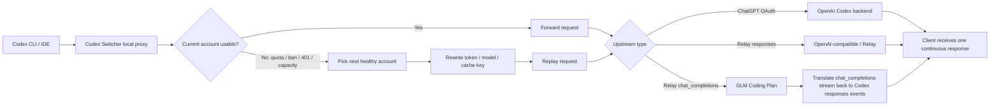

# Codex Switcher

[](https://github.com/xtftbwvfp/codex-switcher/releases/latest)
[](https://github.com/xtftbwvfp/codex-switcher/actions/workflows/release.yml)
[](LICENSE)
[](https://tauri.app/)
[](https://github.com/xtftbwvfp/codex-switcher/releases/latest)

Codex Switcher 是一个面向 Codex CLI / ChatGPT 多账号工作流的桌面工具。它把账号管理、配额观察、本地代理、无损自动切号、Relay 兼容、远程账号池和 Skills 管理放在同一个 Tauri 应用里，适合长期使用 Codex CLI、Codex App，以及支持 Codex 插件的 VS Code 及其衍生 IDE 的多账号环境。

**一句话：当前账号限额了，前端任务不用停，Codex Switcher 在代理层自动换号、切换中转站或接入 Coding Plan，并自动重发请求。Coding Plan 目前已支持 GLM，其他平台待实测。**

[下载最新版](https://github.com/xtftbwvfp/codex-switcher/releases/latest) · [配合 glance 使用](https://github.com/xtftbwvfp/glance)

## 亮点

- **无损切号**：限额、封禁、401、全局容量不足时，代理层自动换号并重发请求，前端软件无感知。
- **GLM Coding Plan 兼容**：把 Codex `/v1/responses` 实时翻译成 OpenAI `/chat/completions`，让 GLM Coding Plan 也能跑 Codex 请求。
- **多账号池**：ChatGPT OAuth、OpenAI Key、Relay/API Key、远程 server/client/solo 账号池统一调度。
- **可观测配额**：5 小时/周配额、token、成本、cache savings、切号原因、周期历史都能看。
- **长期开发友好**：session affinity 保住 prompt cache，`prompt_cache_key` 按账号隔离，减少切号后的缓存污染。
- **跨工具 Skills**：把 Codex/Claude/Gemini/OpenCode 的 Skills 统一发现、安装、同步。

## 目录

- [界面预览](#界面预览)
- [为什么需要它](#为什么需要它)
- [工作方式](#工作方式)
- [推荐组合：GLM Coding Plan + glance](#推荐组合glm-coding-plan--glance)
- [核心能力](#核心能力)
- [功能点速览](#功能点速览)
- [界面模块](#界面模块)
- [账号导入方式](#账号导入方式)
- [兼容矩阵](#兼容矩阵)
- [典型使用方式](#典型使用方式)
- [安装](#安装)
- [从源码运行](#从源码运行)
- [数据和安全边界](#数据和安全边界)

## 界面预览

### 桌面应用


## 为什么需要它

Codex CLI 的账号、配额、Token、缓存和代理问题通常是分散的：一个工具负责登录，一个脚本负责切号，一个代理负责转发，另一个表格记录用量。Codex Switcher 把这些动作收在一个桌面应用里，并且在代理层真正理解 Codex 请求流。

它不只是“换 `auth.json`”。它的王炸功能是：**无损切号**。

- 当前账号触发限额、封禁、401、全局容量不足时，代理层可以自动选下一个可用账号。
- 前端软件无感知，不需要用户手动复制 prompt、重启任务或重新发起请求。
- 对可重试场景，代理会在后台换号并重发请求，客户端看到的是一次连续请求。
- 能把 Codex 的 `/v1/responses` 请求实时翻译成 OpenAI `/chat/completions`，让 GLM Coding Plan 这类并不完整支持 Codex Responses 协议的服务也能接入。
- 能在 SSE 流还没吐给客户端前识别限额、封禁、全局容量不足，然后静默换号重试。
- 能在 WebSocket 消息里识别限额和封禁信号。
- 能按 session 做 sticky routing，尽量保住 prompt cache。
- 能给不同账号隔离 `prompt_cache_key`，避免跨账号缓存污染。
- 能把 ChatGPT 订阅账号、OpenAI Key、第三方 Relay、远程账号池放在同一套切换逻辑里。
- 能记录 5 小时/周周期、每次切号、每个 session 的 token 和成本。

## 工作方式



## 推荐组合：GLM Coding Plan + glance

如果你有 GLM Coding Plan，可以把它接进 Codex Switcher 当 Relay 后端，再配合另一个项目 [glance](https://github.com/xtftbwvfp/glance) 使用。

`glance` 是一个 MCP server，用便宜的子模型处理“读一堆文件再总结”“搜索 GitHub 仓库”“抓网页正文”“OCR/描述图片”“Chrome 自动化”等低难度重活。主 Codex 继续负责架构判断和最终代码修改，GLM Coding Plan 负责消耗大的苦活。

推荐分工：

- Codex Switcher：负责 GLM Coding Plan 接入、协议转换、自动切号、重试和配额可视化。
- glance：负责把跨文件阅读、repo 调研、网页抓取、图片理解这类 token-heavy 工作下放给 GLM/DeepSeek/OpenAI 子模型。
- Codex CLI：拿到压缩后的结论，少读原始大文件，把主模型窗口留给真正需要推理和修改的部分。

这个组合适合长期开发：Codex Switcher 保证请求不中断，glance 让低难度高 token 的任务走 Coding Plan，用更低成本把任务量堆起来。

## 核心能力

### 多账号管理

- 支持 ChatGPT OAuth 账号、OpenAI API Key 账号、第三方 Relay/API Key 账号。
- 一键切换当前账号，写入 Codex CLI 使用的 `~/.codex/auth.json`。
- 支持导入、导出、批量导入账号数据。
- 支持 OAuth 登录、OTP 邮箱批量登录、Token 自动刷新。
- 支持账号禁用、Token 失效、隔离状态识别，并提供修复入口。
- 支持系统托盘快速切换和后台运行。

### 本地代理与自动切号

Codex Switcher 可以启动本地 HTTP/WebSocket 代理，让 Codex CLI 或其他客户端统一走本地端口。代理层会观察请求、SSE 流和错误信息，并在合适时机自动切换账号。

- 支持 HTTP 和 WebSocket 转发。
- 识别 5 小时配额、周配额、全局容量、账号封禁、401 等常见状态。
- 支持低配额阈值提前切号，减少请求失败。
- 支持无损切号：代理层自动换号并重发请求，前端软件不需要感知账号变化。
- 支持静默刷新 Token，降低 Codex CLI 掉登录概率。
- 支持 LAN 访问，可用于局域网或 ZeroTier 环境。
- 支持 session affinity，把同一个 Codex session 尽量绑定到同一账号，保留上下文缓存收益。
- 支持 SSE bootstrap 检测，在错误流真正转给客户端前完成换号和重试。
- 支持流中 2KB 滑动窗口检测限额/封禁信号。
- 支持 30 秒 SSE keep-alive heartbeat，降低长请求空闲断连。
- 支持 WebSocket 双向桥接，并在 WS 消息中识别限额和封禁。
- 支持自动清理已耗尽账号的 session 绑定，让后续请求可重新路由。
- 支持 moderation sample 抓取，便于分析被安全策略拦截的响应。

### Relay / API Key 兼容

Relay 账号用于接入第三方 OpenAI-compatible 服务，或需要自定义 `base_url` / `api_key` 的代理服务。

- 支持自定义 Relay base URL、API Key、主页和余额查询预设。
- 支持模型名映射和 fallback 模型。
- 支持把 Codex `/v1/responses` 请求转换成 `/chat/completions`，兼容只支持 Chat Completions 的服务。
- 支持流式和非流式转换。
- 支持合成 `/v1/models` 响应，便于客户端探测模型。
- 内置 GLM、GLM Coding Plan、FreeModel.dev 等 Relay 预设。
- 支持 GLM 智谱 monitor quota 查询，把 relay 余额/用量显示进账号列表和托盘。
- 支持 GLM `reasoning_content` 到 Codex reasoning item 的流式转换。
- 会丢弃上游不支持的非 GLM tool 类型，减少 provider 拒绝请求的概率。
- 支持通过 deep link 导入 Relay 配置：
  - `codexswitch://...`
  - `ccswitch://...`

#### GLM Coding Plan 兼容

Codex CLI 发出的主协议是 `/v1/responses`。很多 OpenAI-compatible 服务只实现了 `/chat/completions`，直接接会失败或丢失工具调用、reasoning、流式事件。Codex Switcher 的 Relay 翻译层会处理这些差异：

- 请求侧：把 `input`、reasoning item、tool call、function output 转成 Chat Completions messages/tools。
- 响应侧：把 Chat Completions 的 stream delta 还原成 Codex 能理解的 Responses SSE 事件。
- 模型侧：把 Codex 请求里的模型名映射成 GLM 可用模型，例如通过 preset 映射到 `glm-5.1` / `glm-5`。
- 用量侧：支持 GLM quota API，能在 UI 里显示 relay 的剩余额度和百分比。

这意味着上游不需要完整复刻 Codex Responses API，也能被 Codex CLI 当作可用后端。

### 配额、Token 和成本统计

Stats 页面用于长期观察账号池状态和使用成本。

- 展示每个账号的 5 小时配额、周配额、reset 时间、plan 类型。
- 记录每次请求的 input/output/cached input tokens。
- 支持按日、周、月查看 token 使用和估算成本。
- 支持按模型拆分使用量。
- 记录切号历史和切号原因。
- 支持按账号查看 5 小时周期、周周期历史。
- 支持按 session 下钻，分析单个会话消耗。
- 基于 quota snapshot 估算账号真实周期容量。
- 展示 prompt cache 命中和 cached input tokens。
- 估算 cache 节省的成本。
- 统计切号原因分布，便于判断是 5 小时限额、周限额、封禁、Token 失效还是全局容量。
- 通过 quota snapshot 对比不同周期，观察订阅额度是否被 OpenAI 调整。

### 远程模式

远程模式适合多台机器共享同一个账号池，例如主力 Mac、Mini Mac、Windows 运行机之间同步使用。

- `off`：完全本地模式。
- `server`：当前机器提供远程账号池 API。
- `client`：当前机器连接远程 server，同步账号、Token 和切号结果。
- `solo`：单客户端模式，自动和远程当前账号保持一致。

远程 API 使用 shared secret 鉴权，支持健康检查、账号列表、Token 获取、账号增删改、远程切号、solo heartbeat、Skills 同步等能力。

远程模式里有两个细节：

- client 会缓存远程 Token，远程不可用时可以回退本地账号。
- solo heartbeat 会告诉 server 跳过本机刷新，减少多设备同时刷新同一个 refresh token 导致的轮转冲突。

### Skills 管理

Codex Switcher 内置 Skills 管理页面，用于把一组可复用 Agent 能力安装到 Codex、Claude、Gemini、OpenCode 等工具的约定目录。

- 支持从 GitHub 仓库或本地目录添加 Skills 源。
- 支持浏览、安装、卸载 Skills。
- 支持用 SSOT 目录统一管理，再通过 symlink 分发到不同应用。
- 支持从远程 server 同步 Skills。

### IDE 与本机集成

- 支持切换账号后自动重载或重启相关工具。
- 支持 Windsurf、Antigravity、Cursor、VS Code、Codex CLI 等常见入口。
- 支持 macOS 首次运行时的 quarantine 修复入口。
- 支持暗色界面和系统托盘后台运行。

## 功能点速览

| 类别 | 能力 |
| --- | --- |
| 账号 | ChatGPT OAuth、OpenAI Key、Relay/API Key、批量导入导出、OTP 批量登录 |
| 代理 | HTTP、WebSocket、SSE 检测、keep-alive、LAN/ZeroTier、本地端口代理 |
| 自动切号 | 无损切号、自动重发请求、前端无感知、5h 阈值、周阈值、限额识别、封禁识别、401 静默刷新、全局容量处理 |
| Relay | `/v1/responses` 转 `/chat/completions`、模型映射、fallback、provider preset、用量查询 |
| GLM | GLM preset、GLM Coding Plan、GLM quota、reasoning_content 流式转换 |
| 组合 | 搭配 [glance](https://github.com/xtftbwvfp/glance)，把读文件、搜 repo、网页、图片等低难度苦活交给 GLM Coding Plan |
| 缓存 | session affinity、prompt_cache_key 账号隔离、cache savings 统计 |
| 统计 | tokens、成本、模型分布、周期历史、切号原因、quota snapshot |
| 远程 | server/client/solo、shared secret、远程切号、远程 Token、Skills 同步 |
| Skills | GitHub/local repo、发现、安装、卸载、SSOT、跨工具 symlink |
| 集成 | 托盘、IDE 重载、deep link、macOS quarantine 修复 |

## 界面模块

应用主界面按长期使用场景拆成 7 个页面：

| 页面 | 用途 |
| --- | --- |
| Dashboard | 当前账号、配额概览、快速切换、导出、IDE 同步冲突处理 |
| Accounts | 账号列表、plan/Relay 筛选、单账号配额、keepalive、批量刷新 |
| Proxy | 本地代理状态、端口、LAN 暴露、请求/切号计数、自动切号策略 |
| Stats | token、成本、模型分布、周期历史、切号原因、容量估算 |
| Cache | session 绑定、cached input tokens、cache savings、请求历史 |
| Skills | 已安装 Skills、远程发现、仓库管理、跨工具 symlink |
| Settings | 主题、后台刷新、IDE 重载、远程模式、macOS quarantine 修复 |

系统托盘提供轻量弹窗，不打开主窗口也能看到当前账号配额、代理状态、token 统计和推荐下一个账号。

## 账号导入方式

添加账号弹窗不是单一路径，适合把历史账号池快速迁进来：

- OpenAI OAuth：浏览器授权，自动交换 token；回调失败时支持手动粘贴 fallback。
- 从 IDE 导入：自动检测本机 Codex/Windsurf 等工具的 `auth.json`。
- OTP 批量登录：粘贴邮箱列表，自动跑 OTP 流程，显示每行进度并支持失败重试。
- 批量文件导入：支持多种历史格式，自动识别并按邮箱去重。
- Relay 导入：手动填写或通过 `codexswitch://` / `ccswitch://` deep link 一键导入。

## 兼容矩阵

| 类型 | 支持情况 |
| --- | --- |
| ChatGPT OAuth subscription | 支持配额读取、token 刷新、无损切号、周期统计 |
| OpenAI API Key | 支持作为账号类型纳入管理 |
| Relay / OpenAI-compatible | 支持自定义 `base_url` / `api_key` / 模型映射 / 用量预设 |
| GLM Coding Plan | 支持专用 preset、Chat Completions 协议转换、quota 查询 |
| FreeModel.dev | 内置 Relay preset |
| Codex CLI | 主要目标客户端 |
| Windsurf / Cursor / VS Code / Antigravity | 支持账号切换后的 IDE 重载/同步工作流 |
| macOS / Windows / Linux | GitHub Release 多平台构建 |

## 典型使用方式

### 只做手动账号切换

1. 打开应用。
2. 添加或导入多个 ChatGPT OAuth 账号。
3. 在账号列表里点击切换。
4. Codex Switcher 会更新 `~/.codex/auth.json`。
5. 需要时自动刷新或重载 IDE。

### 使用本地代理自动切号

1. 在设置里启用本地代理。
2. 配置代理端口和切号阈值。
3. 让 Codex CLI 或客户端请求走本地代理地址。
4. 当当前账号配额不足、触发限额或 Token 失效时，代理会自动刷新或切换账号。
5. 对可重试请求，代理会后台重发，前端软件无需知道已经换过账号。

### 接入 Relay 服务

1. 添加 Relay 账号。
2. 填入 `base_url`、`api_key`、模型映射和余额查询预设。
3. 对只支持 Chat Completions 的服务，启用协议转换。
4. 在代理模式下混用 ChatGPT OAuth 账号和 Relay 账号。

### 接入 GLM Coding Plan

1. 添加 Relay 账号时选择 GLM Coding Plan preset。
2. 填入 GLM 的 API Key。
3. preset 会自动配置 base URL、Chat Completions 协议转换、模型映射和 GLM quota 查询。
4. Codex CLI 继续按 Responses API 发请求，Codex Switcher 在代理层完成协议转换。

### 用 glance 消化低难度苦活

1. 安装 [glance](https://github.com/xtftbwvfp/glance) 并注册到 Codex MCP。
2. 把 glance backend 配到 GLM Coding Plan。
3. 让 Codex 把“跨文件调研、GitHub repo 探索、网页抓取、图片 OCR/描述”等任务优先交给 glance。
4. Codex Switcher 负责保证 GLM Relay 请求稳定，glance 负责把大段原始材料压缩成短摘要返回给 Codex。

### 多机器共享账号池

1. 在主机器设置为 `server`，配置 bind、port、shared secret。
2. 在其他机器设置为 `client` 或 `solo`。
3. 填入 server URL 和 shared secret。
4. 客户端从 server 获取账号状态、Token 和切号结果。

## 安装

从 [Releases](https://github.com/xtftbwvfp/codex-switcher/releases/latest) 下载最新版本。

### 下载哪个文件

当前发布流程会生成：

- macOS: `aarch64.dmg`、`x64.dmg`、`universal.dmg`
- Windows: `x64-setup.exe`、`x64_en-US.msi`
- Linux: `.deb`、`.rpm`、`.AppImage`

macOS 用户通常下载 `aarch64.dmg`；Intel Mac 下载 `x64.dmg`；不确定架构时下载 `universal.dmg`。

Windows 用户优先下载 `x64-setup.exe`；需要 MSI 部署时下载 `x64_en-US.msi`。

## 从源码运行

环境要求：

- Node.js 20+
- Rust stable
- Tauri 2 所需系统依赖

```bash
npm install
npm run tauri dev
```

只运行前端开发服务器：

```bash
npm run dev
```

生产构建：

```bash
npm run tauri build
```

前端构建检查：

```bash
npm run build
```

Rust 检查：

```bash
cd src-tauri
cargo check
```

## GitHub Actions 发布

Release workflow 在以下情况触发：

- push `v*` tag
- 手动 `workflow_dispatch`

构建矩阵：

- macOS `aarch64-apple-darwin`
- macOS `x86_64-apple-darwin`
- macOS `universal-apple-darwin`
- Ubuntu 22.04
- Windows latest

所有平台构建成功后，`publish-release` job 会把产物上传到对应 GitHub Release。

## 数据和安全边界

Codex Switcher 会在本机保存账号、Token、配额缓存、统计数据和日志。使用前请确认你信任当前机器和用户环境。

常见本地数据位置：

- Codex CLI 当前登录态：`~/.codex/auth.json`
- Codex Switcher 应用数据：`~/.codex-switcher/`
- 代理日志：`~/.codex-switcher/proxy.log`

注意：

- 不要把 `auth.json`、账号导出包、Token、API Key、Relay Key 提交到 Git。
- 远程模式必须使用强 shared secret。
- 允许 LAN 代理访问前，先确认局域网环境可信。
- 机器本地启动器和辅助脚本不属于仓库源码，不应提交。

机器本地文件示例：

```text
C:\Users\Administrator\.codex\start-codex-auto-proxy.ps1
C:\Users\Administrator\Desktop\Start Codex Auto Proxy.bat
C:\Users\Administrator\Desktop\Start Codex Auto Proxy.lnk
~/.codex/start-codex-auto-proxy.sh
~/Desktop/Start Codex Auto Proxy.command
```

仓库只保留可复用的应用代码、文档和构建配置。

## 技术栈

- Frontend: React, TypeScript, Vite
- Desktop: Tauri 2
- Backend: Rust, Tokio, Hyper, Reqwest
- UI: CSS, dark theme
- Release: GitHub Actions

## License

MIT License. See [LICENSE](LICENSE).
